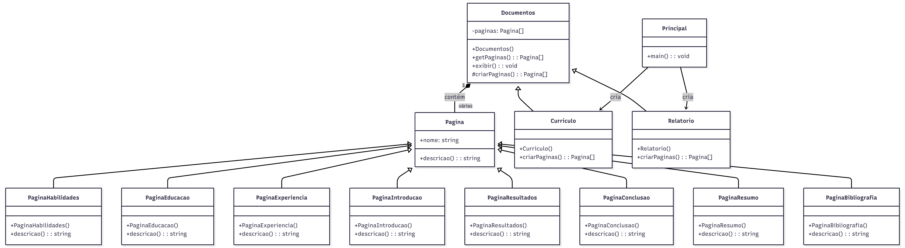

<h1 align="center">🏗️ Factory Method em TypeScript</h1>

  <strong>Exemplo prático do padrão de projeto Factory Method em TypeScript</strong> 
  Criação de diferentes tipos de documentos (Currículos e Relatórios) com páginas específicas.

  

---

## 🧠 Conceito

O **Factory Method** define uma interface para criar objetos, mas permite que as subclasses decidam **qual classe concreta instanciar**.  
Isso delega a responsabilidade da criação às subclasses, permitindo flexibilidade e extensibilidade sem alterar o código cliente.

No exemplo:

- A classe abstrata `Documentos` define o método abstrato `criarPaginas()`.
- As subclasses concretas (`Curriculo` e `Relatorio`) implementam `criarPaginas()` para **definir suas páginas específicas**.
- Cada página (`PaginaHabilidades`, `PaginaEducacao`, etc.) herda da classe abstrata `Pagina` e implementa `descricao()`.

Dessa forma, o código cliente (`Principal`) pode trabalhar apenas com a abstração `Documentos`, sem depender de classes concretas.

---

## 🧱 Diagrama UML

📊 **Representação visual do padrão Factory Method**

